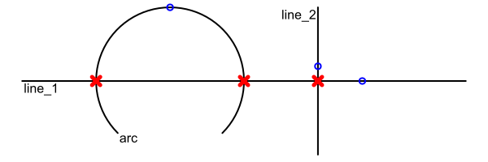
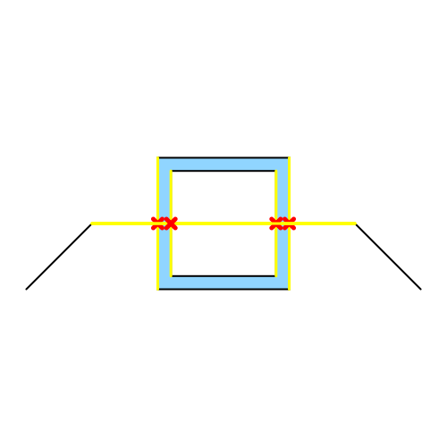

planar_geo
==========

[`ArcSegment`]: https://docs.rs/planar_geo/0.1.1/planar_geo/segment/arc_segment/struct.ArcSegment.html
[`LineSegment`]: https://docs.rs/planar_geo/0.1.1/planar_geo/segment/line_segment/struct.LineSegment.html
[`Segment`]: https://docs.rs/planar_geo/0.1.1/planar_geo/segment/enum.Segment.html
[`SegmentChain`]: https://docs.rs/planar_geo/0.1.1/planar_geo/segment_chain/struct.SegmentChain.html
[`Contour`]: https://docs.rs/planar_geo/0.1.1/planar_geo/contour/struct.Contour.html
[`Shape`]: https://docs.rs/planar_geo/0.1.1/planar_geo/shape/struct.Shape.html
[`Primitive`]: https://docs.rs/planar_geo/0.1.1/planar_geo/primitive/trait.Primitive.html
[`Composite`]: https://docs.rs/planar_geo/0.1.1/planar_geo/composite/trait.Composite.html
[`Transformation`]: https://docs.rs/planar_geo/0.1.1/planar_geo/trait.Transformation.html
[`DEFAULT_EPSILON`]: https://docs.rs/planar_geo/0.1.1/planar_geo/constant.DEFAULT_EPSILON.html
[`DEFAULT_MAX_ULPS`]: https://docs.rs/planar_geo/0.1.1/planar_geo/constant.DEFAULT_MAX_ULPS.html
[`Context`]: https://gtk-rs.org/gtk-rs-core/stable/latest/docs/cairo/struct.Context.html
[gtk-rs]: https://gtk-rs.org/gtk-rs-core/stable/latest/docs/cairo
[approxim]: https://docs.rs/approxim/latest/approxim/
[serde]: https://serde.rs/
[`ulps_eq`]: https://docs.rs/approxim/latest/approxim/macro.ulps_eq.html

A Rust library for 2D geometry: geometric objects, algorithms and visualization.

# Overview

This library is based on the basic "point" `[f64; 2]` type, whose first element
represents its x-coordinate and the second element represents its y-coordinate.
Building upon this, a variety of [`Primitive`] and [`Composite`] types are
defined:


_This image was created with examples/type_overview.rs_

The "segment" types are so-called [`Primitive`]s: Simple straight
([`LineSegment`]) or arc ([`ArcSegment`]) connections between two points. They
form the basis for the [`Composite`] types [`SegmentChain`], [`Contour`] (a
closed segment chain) and [`Shape`] (composed of one or more contours).

For these types, this crate offers the following features:
- Property calculation (e.g. length, surface area, centroids),
- [`Transformation`] (scaling, shifting, rotation, mirroring),
- Intersection calculation between all combinations of the aforementioned types,
see the [`Primitive`] and [`Composite`] traits.

If the corresponding features are activated, it is also possible to serialize
and deserialize (using [serde]) and to visualize (using [gtk-rs]) these types.
See the [Features](#features) section for more.

One distinct feature of this library is the treatment of arcs: Arcs are not
approximated as polylines (i.e. a connected series of line segments), but
instead being represented as "true" arcs (see e.g. the examples for surface
area calculation below). In fact, this is the reason why this library was
written in the first place.

Since the "point" type is defined using the floating-point type `f64`, a lot of
operations (i.e. intersection calculation) are prone to rounding-errors. These
operations therefore require specifying an absolute tolerance `epsilon` and a
maximum units in last place tolerance `max_ulps`, which are used as inputs
for [`ulps_eq`] (from the [approxim] crate) to e.g. determine whether two points
are approximately equal. It is recommended to use the "default" tolerances
[`DEFAULT_EPSILON`] and [`DEFAULT_MAX_ULPS`] unless there is a good reason to
use other values.

The following paragraphs will provide some examples for the aforementioned
features.

## Construction and property calculation

The following code snippet shows how to construct the shape shown in the image
below and calculate some of its properties, e.g. centroid and surface area. The
image itself has been created by running `examples/shape.rs`.


```rust
use planar_geo::prelude::*;
use std::f64::consts::{PI, FRAC_PI_2};
use approx;

// For brevity
let e = DEFAULT_EPSILON;
let m = DEFAULT_MAX_ULPS;

// Construct an arc, a line and another arc using various constructors. These
// constructors can fail for invalid input data, see the expect() strings.
let first_arc =
    ArcSegment::from_center_radius_start_offset_angle([1.5, 0.0], 1.5, PI, -FRAC_PI_2, e, m)
        .expect("radius is positive and offset angle is not zero");
let line = LineSegment::new([1.5, 1.5], [3.5, 1.5], e, m)
    .expect("segment length is not zero");
let second_arc = ArcSegment::from_start_center_angle([3.5, 1.5], [3.5, 0.0], -FRAC_PI_2, e, m)
    .expect("radius is positive and offset angle is not zero");

// Build a segment chain from these three segments
let mut chain = SegmentChain::new();

// Initially, the chain is empty (has no segments)
assert_eq!(chain.num_segments(), 0);

// Now add the three segments
chain.push_back(first_arc.into());
chain.push_back(line.into());
chain.push_back(second_arc.into());
assert_eq!(chain.num_segments(), 3);

// Create a contour out of the chain. If start and end of the chain are not
// identical, a line segment is automatically added.
let contour = Contour::new(chain);

// During the conversion to a contour, a line segment has been added which closes the chain
assert_eq!(contour.num_segments(), 4);

// Create a second contour by creating multiple line segments directly from vertices.
let hole = Contour::new(SegmentChain::from_points(&[[1.5, 0.2], [3.5, 0.2], [3.5, 1.3], [1.5, 1.3]]));

// First element of the vector is interpreted as outer contour, all further
// elements are holes. The resulting shape is visualized below the code snippet.
let shape = Shape::new(vec![contour, hole]).expect("inputs form a valid shape");

// Calculate the surface area: Area of outer contour minus hole area
let quarter_circle_area = 0.25 * PI * (1.5f64).powi(2);
let center_rect_area = 1.5 * 2.0;
let hole_area = 1.1 * 2.0;

// Exact match except for floating point rounding errors (arcs are not
// approximated as polylines)
approx::assert_abs_diff_eq!(shape.area(), 2.0 * quarter_circle_area + center_rect_area - hole_area, epsilon = 1e-15);

// Length of the hole contour
approx::assert_abs_diff_eq!(shape.holes()[0].length(), 2.0 * (1.1 + 2.0), epsilon = 1e-15);

// Length of the first arc -> Is the first segment of the contour
// 0.5 * 1.5 * PI = Quarter circle circumference times radius.
approx::assert_abs_diff_eq!(shape.contour()[0].length(), 0.5 * 1.5 * PI, epsilon = 1e-15); 

// Centroid of the hole
approx::assert_abs_diff_eq!(shape.holes()[0].centroid(), [2.5, 0.75], epsilon = 1e-15);
```

## Transformation

The [`Transformation`] trait allows translating, rotating, scaling and mirroring
of all [`Primitive`] and [`Composite`] types:

```rust
use planar_geo::prelude::*;
use std::f64::consts::PI;

// For brevity
let e = DEFAULT_EPSILON;
let m = DEFAULT_MAX_ULPS;

// Translate a point
let mut pt = [2.0, 2.0];
pt.translate([1.0, 2.0]);

assert_eq!(pt, [3.0, 4.0]);

// Rotate a line segment
let mut ls = LineSegment::new([1.0, 0.0], [2.0, 0.0], e, m).expect("points are not equal");
ls.rotate([1.0, 1.0], PI);

approx::assert_abs_diff_eq!(ls.start(), [1.0, 3.0], epsilon = 1e-15);
approx::assert_abs_diff_eq!(ls.start(), [0.0, 3.0], epsilon = 1e-15);

// Scale a segment chain
let mut chain = SegmentChain::from_points(&[[0.0, 0.0], [1.0, 0.0], [1.0, 1.0]]);
chain.scale(3.0);

let mut pts = chain.points();
assert_eq!(pts.next(), Some([0.0, 0.0]));
assert_eq!(pts.next(), Some([3.0, 0.0]));
assert_eq!(pts.next(), Some([3.0, 3.0]));

// Mirror a contour
let mut contour = Contour::new(chain);
contour.line_reflection([0.0, 0.0], [0.0, 1.0]);

let mut pts = chain.points();
assert_eq!(pts.next(), Some([0.0, 0.0]));
assert_eq!(pts.next(), Some([-3.0, 0.0]));
assert_eq!(pts.next(), Some([-3.0, 3.0]));
```

## Intersections

A major feature of this crate are the various methods available to find
collisions and intersections between different geometric types. 

For example, the following code shows intersections between the segments shown
in this image:



_This image was created with examples/intersection_segments.rs_

```rust
use planar_geo::prelude::*;
use std::f64::consts::PI;

// Abbreviated to make examples more concise
let e = DEFAULT_EPSILON;
let m = DEFAULT_MAX_ULPS;

let line_1: Segment = LineSegment::new([0.0, 0.0], [3.0, 0.0], e, m)
    .expect("segment length is not zero").into();
let line_2: Segment = LineSegment::new([2.0, -0.5], [2.0, 0.5], e, m)
    .expect("segment length is not zero").into();
let arc: Segment = ArcSegment::from_center_radius_start_offset_angle(
    [1.0, 0.0],
    0.5,
    -0.25*PI,
    1.5*PI,
    e,
    m,
).expect("offet angle is not zero").into();

// Are the following points part of the respective segment?
let pt1 = [2.3, 0.0];
let pt2 = [2.0, 0.1];
let pt3 = [1.0, 0.5];

assert!(line_1.contains_point(pt1, e, m));
assert!(!line_1.contains_point(pt2, e, m));
assert!(line_2.contains_point(pt2, e, m));
assert!(arc.contains_point(pt3, e, m));

// Find intersections between the segments. The order doesn't matter, i.e.
// line_1.intersections_primitive(&line_2) produces the same result as
// line_2.intersections_primitive(&line_1).

// line_1 and line_2 intersect once in point (2, 0)
assert_eq!(line_1.intersections_primitive(&line_2, e, m), PrimitiveIntersections::One([2.0, 0.0]));

// line_1 and arc intersect twice (in (0.5, 0.0) and (1.5, 0.0))
assert_eq!(line_1.intersections_primitive(&arc, e, m), PrimitiveIntersections::Two([[1.5, 0.0], [0.5, 0.0]]));

// line_2 and arc don't intersect at all
assert_eq!(line_2.intersections_primitive(&arc, e, m), PrimitiveIntersections::Zero);
```

It is also possible to calculate the intersections between composite types, as
shown in `examples/intersection_composites.rs`:



# Features

## Serialization and deserialization

When the `serde` feature is enabled, all geometric objects can be serialized and
deserialized using the [serde](https://crates.io/crates/serde) crate.

## Visualization

When the `cairo` feature is enabled, all geometric objects have a `draw`
method which can be used to draw them onto a 
[cairo](https://gtk-rs.org/gtk-rs-core/stable/latest/docs/cairo/) [`Context`].
See the [module-level documentation](link to module) for more. All images used
in the documentation were created using this functionality.

# Documentation

The full API documentation is available at
[https://docs.rs/planar_geo/0.1.1/planar_geo/](https://docs.rs/planar_geo/0.1.1/planar_geo/).