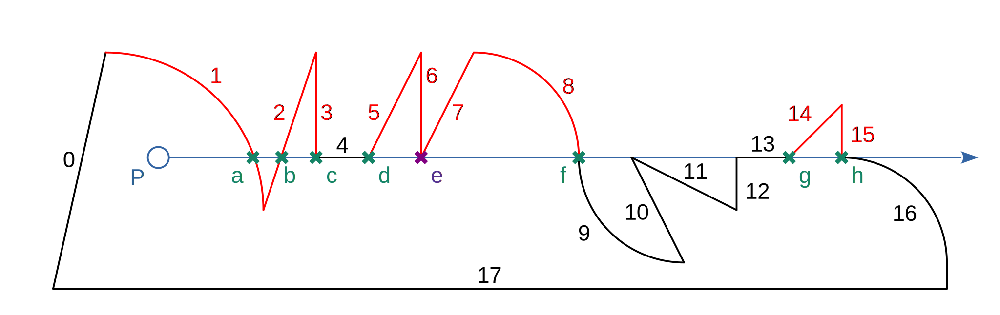
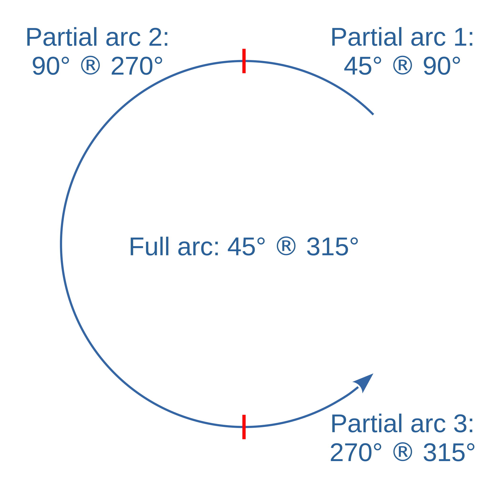
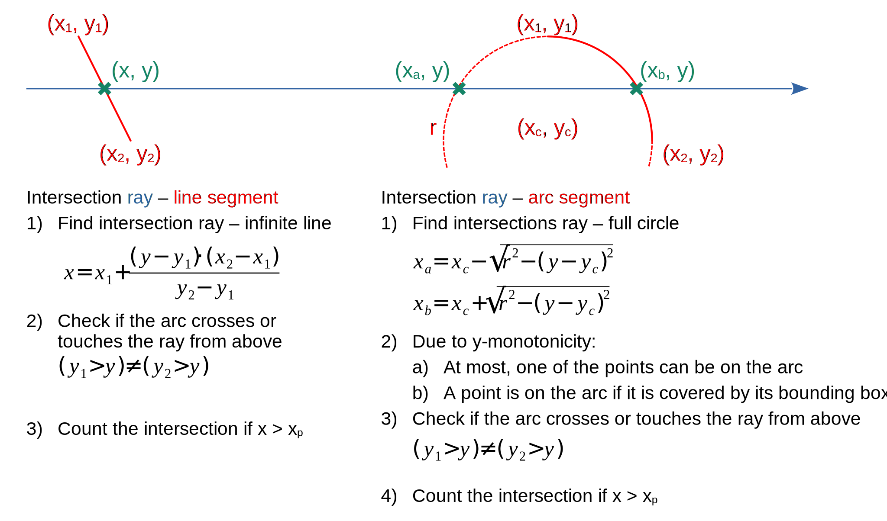

# Is a point inside a contour?

This whitepaper describes a numerical stable algorithm for detecting if a point
is inside an enclosed planar (2D) space described by one or more connected
circular arc and line segments (called a "contour" in the following). It is used
in the planar_geo crate to implement `Contour::contains_point`.

The core idea of the algorithm is _ray casting_: Starting from the point in
question, draw a line to any point located at infinity and count the number of
intersections with the contour segments. If that number is even, the point is
outside the contour, otherwise it is inside. Without the loss of generality,
let's assume that the point `P` in question is at (xp, yp)
and the end of the ray is at (+∞, yp). The image below shows an
involved example of P inside a contour made up of black and red segments. The
ray is drawn as a blue arrow and its intersections with the contour segments are
marked as X:

A segment intersection with the ray is only counted if at least one point of the
segment is above the ray. This means that all red segments have an intersection
with the ray, while the black ones don't. Of particular note are segments 6 and
7: Both intersect the ray at the same point e, which therefore needs to be
counted twice. Overall, there are 9 intersections (two intersections at e!),
meaning that the point is inside the contour.

## Finding valid intersections

Since the ray is horizontal, there exists a simple way to determine if a
segment intersects it AND has at least one point above it. It requires that the
segment is y-monotonous, i.e. no two points of it share the same y-value. For
a line segment, this is true as long as the segment is not horizontal (which is
trivial to determine by simply comparing the y-values of the end points). As
shown in the image, horizontal segments such as 4 and 13 are therefore simply
skipped when searching for intersections.

A circular segment can be separated into multiple y-monotonous partial segments:

Line segments and circular segments can now be treated in a very similar
fashion to check the aforementioned conditions (segment intersects ray and has
at least one point above it):

### Line segment

1. Treat the segment as an infinite line and find the point on the line where
y = yp. Since horizontal line segments are skipped, such a point is
guaranteed to exist (the denominator cannot become zero).
2.  Since a line segment is y-monotonous, it is at least partially above the ray
if one of its end points is larger than y and the other one isn't. This is the
case if (y1 > y) ≠ (y2 > y) evaluates to true.
3. Check if the found intersection is located on the ray. This is the case if
x > xp.

If the conditions 2 and 3 are both true, a valid intersection has been found and
the counter is increased by 1.

### Arc segment

The essential idea here is to treat circular arc segments in the same way as
line segments: Steps 3 and 4 correspond to 2 and 3 of the line segment section.

1. Treat the segment as a full circle and check if one or two points at the ray
height yp exist on the circle. This is the case if the term below
the root is positive. If it is 0, one point exists, otherwise there are two
points.
2. Since the (partial) arcs are y-monotonous:

    - Either one or none of the found point(s) is located on the arc.
    - A point is located on the arc if it inside its bounding box (defined by
    the x- and y-extents of the arc).

3. If one of the points has been found as being located on the arc in the
previous step, the same logic as with the line segment applies: At least one of
the points of the arc is above the ray if
(y1 > y) ≠ (y2 > y) evaluates to true.
4. Check if the found intersection is located on the ray. This is the case if
x > xp.

If the conditions 3 and 4 are both true, a valid intersection has been found and
the counter is increased by 1.

## Conclusion

While the core idea of the ray casting algorithm is pretty straightforward,
implementing it in a numerically stable manner is challenging if the ray
goes through the transition points of two neighboring segments. To dermine if
an intersected transition point needs to be counted zero, one or multiple times,
the presented algorithm simply checks if a segment is (partially) above the ray.
Using the example contour from the beginning, this means that the transition
point f between segments 8 and 9 is only counted for 8, while the point e is
counted twice (once for 6 and once for 7). Ignoring all segments which are not
(partially) above the ray avoids e.g. counting f (wrongly) twice. 